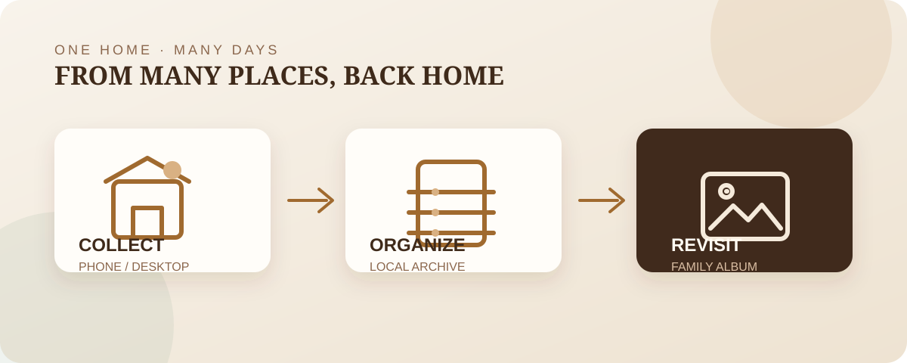
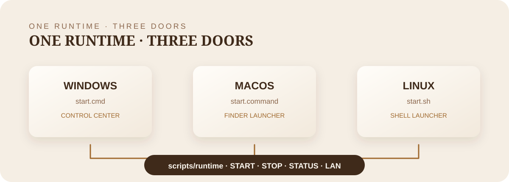

# 围炉 Hearth

> 把家里的照片，变成一家人的时间。

围炉是一间运行在家中电脑上的私人家庭影像馆。照片和视频从手机、电脑或数据线回到家里，经过整理后，家人可以在同一个浏览器入口里一起回看、收藏、评论和补全故事。

<p align="center">
  
</p>

## 它是什么

围炉把家庭相册做成一个安静、长期可依赖的本地空间：原片留在自己的电脑上，不依赖云相册，也不把私人照片交给第三方。它适合希望把家人记忆留在家里、又想让全家都能方便使用的人。

<p align="center">
  
</p>

你可以用它：

- 从手机浏览器或二维码快速上传照片和视频；
- 用网页数据线向导或 ADB 导入 Android 手机；
- 按拍摄时间、地点和标签浏览照片，播放视频；
- 收藏、评论，让每个人都能给照片补上一点记忆；
- 用 Docker 长期运行，并通过完整备份保护数据。

## 开始使用

第一次运行：

```powershell
node scripts/maintenance/setup.mjs
```

之后按系统选择入口：

| 系统 | 启动 | 停止 |
| --- | --- | --- |
| Windows | [`scripts/platform/windows/start.cmd`](scripts/platform/windows/start.cmd) | [`scripts/platform/windows/stop.cmd`](scripts/platform/windows/stop.cmd) |
| macOS | [`scripts/platform/macos/start.command`](scripts/platform/macos/start.command) | [`scripts/platform/macos/stop.command`](scripts/platform/macos/stop.command) |
| Linux | [`scripts/platform/linux/start.sh`](scripts/platform/linux/start.sh) | [`scripts/platform/linux/stop.sh`](scripts/platform/linux/stop.sh) |

Windows 也可以双击 [`start-gui.vbs`](scripts/platform/windows/start-gui.vbs) 打开控制中心。启动后：

- 电脑访问 `http://localhost:3080`；
- 手机连接同一个 Wi-Fi 后，打开电脑显示的局域网地址，或在「手机快传」里扫码；
- 初始密码保存在本机 `.local-access.txt`，不会被提交到 Git。

<p align="center">
  
</p>

## 资料

- [使用手册](docs/USER_GUIDE.md)：启动、导入、手机快传和常见问题。
- [维护手册](docs/MAINTENANCE.md)：更新、备份、恢复、排障和质量检查。
- [架构说明](docs/ARCHITECTURE.md)：目录边界和运行流程。
- [贡献指南](CONTRIBUTING.md)：提交代码前的检查项。
- [English README](README.en.md)

围炉目前采用一个家庭共享密码，运行方式以本地 Docker 为主。它的重点不是把所有功能都塞进来，而是让照片留在家里，并且能够被家人自然地使用很多年。
